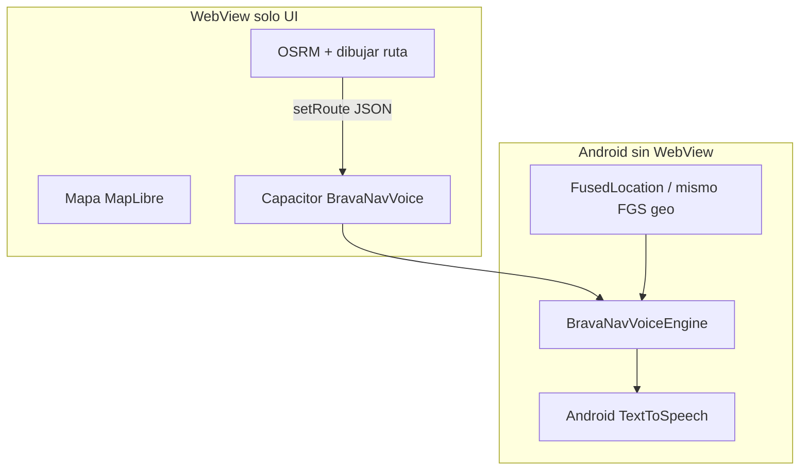

# Navegación y seguimiento — repartidor (Brava)

Documento para **retomar pruebas en calle**. Cuando vuelvas, completá la sección [Resultados](#resultados) y avisá en el chat.

**App repartidor:** APK Capacitor (carga web desde Vercel) · `https://brava-burgers.vercel.app/repartidor/`  
**Seguimiento cliente:** link WhatsApp → `/seguimiento/?t=…`  
**APK referencia:** 1.3.3 (versionCode 11) — `BravaRepartoSession`: reportTrack nativo + última posición al despertar pantalla.

---

## Qué probar (checklist)

### 1. GPS y mapa del cliente

| # | Pregunta | Cómo probar |
|---|----------|-------------|
| 1.1 | ¿El **cliente** ve moverse el 🛵 en el mapa con la app repartidor **abierta** (pantalla navegación)? | Iniciar recorrido → parada en camino → abrir link seguimiento en otro celular. |
| 1.2 | ¿Sigue moviéndose con la app repartidor **minimizada** (no cerrada)? | Minimizar 2–3 min, refrescar seguimiento. |
| 1.3 | ¿Sigue con **pantalla apagada** del repartidor? | Mismo test, pantalla bloqueada. |
| 1.4 | ¿En admin / Supabase se actualizan `track_lat` / `track_lng` / `track_at`? | Opcional: admin o DB. |

**Si falla:** anotar modelo de celular, Android version, si batería está en “Sin restricciones”, si ubicación es “Siempre”.

---

### 2. Push y alertas (repartidor)

| # | Pregunta | Cómo probar |
|---|----------|-------------|
| 2.1 | ¿Llega **push + sonido** al **publicar ruta** en Admin → Reparto? | Repartidor logueado, app en segundo plano. |
| 2.2 | ¿Aviso al **modificar** ruta (quitar parada / vaciar)? | Misma app en background. |
| 2.3 | ¿Cuánto tarda? (aprox. segundos) | Anotar: instantáneo / &lt;10 s / más. |
| 2.4 | ¿El **poll** (~8 s) cubre si el push falla? | Modo avión off/on o push desactivado. |

---

### 3. Voz / navegación in-app (sin Google/Waze)

| # | Pregunta | Cómo probar |
|---|----------|-------------|
| 3.1 | Chip **Voz** encendido: ¿suena al **cargar ruta** (“Parada N…”) | Iniciar recorrido → mapa. |
| 3.2 | ¿Avisos por **distancia** al manejar (en X metros, girá…)? | Conducción real o simular ruta. |
| 3.3 | ¿TTS con **pantalla apagada**? | Solo voz nativa (APK), no web en Chrome. |
| 3.4 | ¿**Recorrido iniciado** solo dice eso (sin WhatsApp en voz)? | TTS al tocar Iniciar recorrido. |

---

### 4. Seguimiento cliente (textos y ETA)

| # | Esperado | Cómo probar |
|---|----------|-------------|
| 4.1 | Lejos: *Tu pedido va en camino* + **Llegada estimada: HH:MM - HH:MM** | GPS vivo + ruta OSRM. |
| 4.2 | GPS **≤ ~180 m** del domicilio: *El repartidor está cerca* (no “puerta”) | Acercarse sin confirmar llegada. |
| 4.3 | Tras **Confirmar llegada** en app: *El repartidor está en la puerta* | WhatsApp al cliente + cambio de texto. |
| 4.4 | Tras **entregado**: mapa apagado, estado entregado | Marcar entrega en handoff. |

---

### 5. Flujo operativo rápido

- [ ] Login → permisos nativos (ubicación, notificaciones, batería) sin pantalla intermedia gris.
- [ ] Iniciar recorrido → WhatsApp a clientes (cocina).
- [ ] Confirmar llegada → toast *Cliente avisado* (sin TTS WhatsApp).
- [ ] Entregar → siguiente parada o ruta completa.

---

## Temas para **más tarde** (no bloquean hoy)

Estas dudas quedaron anotadas para un siguiente sprint:

1. **Resiliencia de red** — cola de `reportTrack` si no hay datos; mensaje “Sin señal, reintentando…”.
2. **Push con acción** — tocar notificación y abrir parada / lista (deep link).
3. **Versión mínima APK** — aviso “Actualizá la app” cuando suba `versionCode`.
4. **Batería denegada** — aviso persistente en lista si no aceptó “Sin restricciones”.
5. **TTS por paso** — silenciar voz en lista/push y solo en mapa (si lo piden).
6. **Prueba de entrega** (foto/firma), soporte a cocina desde app, métricas admin.

Referencias técnicas: `REPARTIDOR_CAP_PRO.md`, `mobile-repartidor/MOBILE_REPARTIDOR.md`, `repartidor/index.html`, `seguimiento/index.html`.

---

## Resultados

Completá cuando vuelvas de probar (Sí / No / A veces + notas):

```
Fecha prueba:
Celular repartidor (modelo + Android):
APK instalada (versión):

1. GPS
  1.1 foreground: 
  1.2 minimizada: 
  1.3 pantalla apagada: 
  Notas:

2. Push
  2.1 publicar ruta: 
  2.2 modificar ruta: 
  2.3 latencia: 
  Notas:

3. Voz
  3.1 intro ruta: 
  3.2 en movimiento: 
  3.3 pantalla apagada: 
  Notas:

4. Seguimiento cliente
  4.1 ETA horario: 
  4.2 cerca (GPS): 
  4.3 puerta (confirmar llegada): 
  4.4 post-entrega: 
  Notas:

5. Flujo operativo: 

Prioridad para arreglar primero:
```

---

## Voz de navegación sin depender del WebView (plan)

### Por qué hoy falla con pantalla apagada

| Capa | Qué hace | Con pantalla apagada |
|------|----------|----------------------|
| **WebView** (`repartidor/index.html`) | Calcula distancia a la maniobra, llama `speak()` | JS **se pausa** → no hay avisos |
| **Plugin TTS** (nativo) | Reproduce audio si **alguien lo invoca** | No se invoca si el JS no corre |
| **Background geo** (nativo) | GPS + FGS + `reportTrack` | Sigue (APK 1.3.2+) |

El TTS ya es nativo, pero **quien decide cuándo hablar** sigue siendo JavaScript.

### Arquitectura objetivo



1. Al cargar ruta, el JS manda **una sola vez** a nativo:
   - polyline `routeCoords` (lng/lat),
   - `steps[]` con texto ya armado (`maneuverText`) y distancia acumulada por paso,
   - umbrales de voz (480 / 200 / 75 / 22 m).
2. **`BravaNavVoice.start()`** al entrar en pantalla navegación; **`stop()`** al salir o entregar.
3. El motor nativo:
   - recibe ubicación del **mismo** flujo de GPS (listener propio o broadcast del plugin background-geolocation),
   - calcula distancia a la maniobra (misma lógica que `posDistanceAlongRouteM` / `maybeSpeakNavVoice`),
   - habla con **`TextToSpeech` en Kotlin/Java** (no llama al plugin Capacitor TTS desde JS).
4. El WebView puede seguir actualizando el mapa cuando está activo; **no hace falta** para la voz.

### Plugin Capacitor propuesto

| Método JS | Nativo |
|-----------|--------|
| `BravaNavVoice.setRoute({ coords, cues, thresholds })` | Guarda ruta en memoria |
| `BravaNavVoice.start()` | Registra location updates + TTS |
| `BravaNavVoice.stop()` | Quita listener, cancela cola TTS |
| `BravaNavVoice.setEnabled({ on })` | Respeta chip “Voz” |

**Archivos:** `mobile-repartidor/android/.../BravaNavVoicePlugin.java`, registrar en `MainActivity.registerPlugin(...)`.

**FGS:** reutilizar el servicio de ubicación ya activo en recorrido; el motor puede usar `FusedLocationProviderClient` en el proceso de la app mientras el FGS de geo está arriba (misma APK, sin segundo servicio al inicio).

### Fases de implementación

| Fase | Entregable |
|------|------------|
| **B1** | Plugin + motor mínimo: distancia en línea recta al punto de maniobra (más simple que proyección en polyline) |
| **B2** | Port de `posDistanceAlongRouteM` a Java (paridad con web) |
| **B3** | Reroute: `setRoute` de nuevo tras recalcular OSRM |
| **B4** | Opcional: `FOREGROUND_SERVICE_TYPE_MEDIA_PLAYBACK` si algún OEM corta audio sin tipo media |

### Qué no resolvería solo

- **Mapa en vivo del repartidor** sigue en WebView (está bien).
- **Push** ya es nativo (FCM + LocalNotifications).
- Reemplazar todo el repartidor por app 100 % nativa no hace falta para este problema.

---

## Commits recientes (contexto)

- Cap Pro, TTS, permisos nativos, APK 1.3.1
- TTS recorrido / toast llegada
- Seguimiento: cerca vs puerta, ETA franja horaria

Repo: `BravaBurgers/` en https://github.com/YezeGames/brava-burgers · rama `main`.
