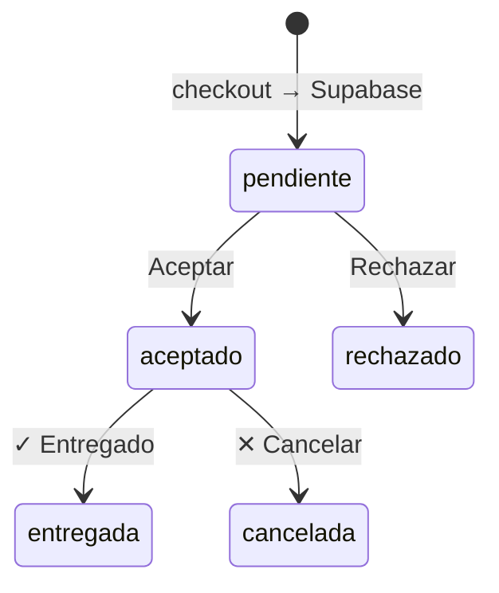

# Brava Burgers — planificación e ideas


Archivo vivo del proyecto. Acá anotamos ideas, prioridades y decisiones.  

Cuando quieras agregar algo, decilo en el chat y lo incorporamos acá.


---

## Estado actual (sep 2026)

Resumen de lo **operativo en producción** (https://brava-burgers.vercel.app/admin/). Docs detallados: [`PEDIDO_MANUAL.md`](PEDIDO_MANUAL.md), [`WHATSAPP_OPERACION.md`](WHATSAPP_OPERACION.md), [`ZONAS_ENTREGA.md`](ZONAS_ENTREGA.md).

| Área | Estado |
|------|--------|
| Tienda web (UI actual, checkout probado) | ✅ |
| Zonas delivery (Mapbox + `/api/delivery-zone` + GeoJSON) | ✅ |
| Panel admin (órdenes, caja, stock, comanda) | ✅ |
| Inbox WhatsApp (`wa-panel.js`) | ✅ |
| Pedido manual WA/teléfono | ✅ |
| Reclamos: gratificar (cupón) + reenvío $0 | ✅ (`compensaciones.js`) |
| Filtros órdenes (tel + EF/MP) | ✅ |
| Editar comanda en Aceptados | ✅ |
| Caja: refresh manual, salidas por burger | ✅ |

**Pendiente operativo (Sheet):** columna **`Atajo`** en pestañas `productos` y `extras`.

**Tienda — lanzamiento público:** hoy tiene `noindex` (Google no indexa). Ver sección *noindex* abajo. Al abrir al público: quitar esa meta.

**UI tienda:** se mantiene la **UI actual** en producción. Demos/redesigns HTML eliminados del repo (sep 2026).

**Descartado / no priorizar:**

- Flujo “My Maps en vivo” como proyecto aparte (polígonos ya en `data/zonas-entrega.geojson`; Mapbox en checkout).
- Plantillas Meta WhatsApp fuera de ventana 24 h.
- Purge automático de chats cada 24 h (sí hay limpieza de chats de **pedido** al **cerrar turno**).
- Retiro en local / `ORN-RET`, pasarela MP online.

---


Documento único de **alcance deseado** (histórico). Producción: `index.html` (tienda) + `/admin/`.


### 1. Tienda (operativa — UI actual)


- Catálogo y config desde **Google Sheet** (`productos`, `configuracion`, `extras`, `ingredientes`).

- Cliente arma carrito → checkout **Mapbox + zonas** → **WhatsApp** + ORN en Supabase.

- **Checkout probado** (sep 2026): zonas, turnos, cupón, pedido a panel.

- **Delivery solo** — sin retiro en local.

- **`noindex`** en `index.html` hasta apertura pública (ver abajo).


### 2. Guardar pedidos — Supabase (operaciones)


- Tablas **`orders`**, **`gastos`**, contador **`admin_counters`** (`orn_del`, `gasto_id`).

- Contador **`ORN-DEL-0001`** vía RPC `next_orn_del()` (solo delivery).

- Escritura/lectura desde **Vercel** (`api/pedido.js`, `api/admin.js`) con **service role** en servidor; nada secreto en el JS público.

- Cada pedido: datos cliente, tel, dirección, turno, zona, envío, **Efectivo / Mercado Pago**, ítems + aclaraciones (`items_json`), total, estado, flags **editado**, timestamps.

- Schema: **`supabase/schema.sql`**. Guías: **`AYUDA_SUPABASE.md`**, **`VERCEL_SUPABASE_RAPIDO.md`**.

- **Fallback legacy:** si Supabase no está configurado en Vercel, `/api/*` puede usar **Apps Script + Sheet** (`BRAVA_GAS_URL`). En producción el camino principal es **Supabase**.


### 3. Panel `/admin` (login usuario + contraseña)


Pantalla **Órdenes** tipo deli (referencia capturada), adaptada a Brava:


| Elemento | Detalle |

|----------|---------|

| **Pestañas** | **Pendientes** · **Aceptados** · **Rechazados** · **Entregados** · **Cancelados** |

| **Filtros** | Fecha desde/hasta, **Pago** (EF / MP / Todos), **tel/cliente** en pipeline |

| **Columnas** | Fecha, Cliente, **Teléfono**, Método de pago, Total, ORN, Acciones |

| **Buscar** | Por **teléfono** / cliente en barra de órdenes; ORN en comanda |

| **Pendientes** | Aviso sonoro · **Aceptar** / **Rechazar** · WA · ticket |

| **Aceptados** | **Editar** · ticket · WA · **✓ entregado** · **✕ cancelar** |

| **Rechazados** | WA consulta · solo lectura |

| **✓ entregado** | Desde **Aceptados** → Entregados; **suma caja** (EF o MP) |

| **✕ cancelar** | Desde **Aceptados** → Cancelados |

| **Rechazar** | Desde **Pendientes** → Rechazados (modal motivos + WA) |

| **Editar** | Mismo ORN; reimprimir comanda; total al entregar |

| **Caja del día** | EF + MP entregados; cancelados info; **− gastos**; estados intermedios no suman |
| **Registro de ventas** | Por turno de caja: hamburguesas (simples/dobles) + **Acompañamientos** + **Extras** + **Bebidas** (catálogo completo del Sheet, cantidades del turno) |

| **Gastos** | Alta/baja en Supabase; restan del **resultado del día** |

| **Tiempo real** | **Supabase Realtime** en el navegador (+ polling de respaldo). Indicador “En vivo · Supabase” |


### 4. Comanda impresa (80 mm)


- **Igual** para Efectivo y Mercado Pago; solo cambia línea **Medio de pago**.

- Incluye: **ORN-DEL-…**, cliente, tel, dirección, turno, ítems, **Acl.:** por ítem, envío, total.

- **Sin “Estado”** en el papel.

- **Pendiente:** ~~imprimir desde panel~~ → Ticket abre comanda real (`admin/comanda.html`).


### 5. Mercado Pago


- **Solo etiqueta** en pedido y caja; **cobro manual** (transferencia, etc.).

- **Sin** cobro automático ni webhooks por ahora.


### 6. Fuera de alcance (por ahora)


- Retiro en local / `ORN-RET`.

- Pasarela MP online.

- Volver a usar **Sheet como fuente única** de pedidos en el día a día (reemplazado por Supabase para operaciones).


### 7. Por construir — histórico


1. ~~Schema Supabase + Vercel env + `/api/pedido` + `/api/admin`~~ → hecho.

2. ~~Admin: pestañas, caja, gastos, rechazo, sonido~~ → hecho.

3. ~~Comanda dinámica desde pedido real~~ → hecho.

4. ~~Editar comanda en admin producción~~ → hecho.

5. ~~Filtros Pago + buscar por tel en panel~~ → hecho.

6. ~~Pedido manual + agenda clientes~~ → hecho (ver [`PEDIDO_MANUAL.md`](PEDIDO_MANUAL.md)).

7. ~~Zonas checkout con Mapbox + polígonos~~ → hecho (ver [`ZONAS_ENTREGA.md`](ZONAS_ENTREGA.md)).

8. ~~Reclamos / gratificación (cupón + reenvío)~~ → hecho (`admin/compensaciones.js`).

9. Opcional: importar histórico Sheet operaciones → Supabase.


---


## En curso / próximo


1. **Columna `Atajo` en Google Sheet** (`productos`, `extras`) — acelerar pedido manual (código ya lo lee).

2. Probar ciclo completo en operación real: web + manual → entregar → caja → cierre.

3. Actualizar docs al cerrar cada ítem (este archivo).

4. **Demo centro de caja/turno** (`admin/demo-caja-turno.html`) — validar UI/gráficos antes de embed en `/admin` y cablear Supabase.


Implementado en repo: `supabase/`, `lib/bravaSupabase.js`, `api/`, `admin/` (pedido manual, compensaciones, wa-panel, caja v126+, demo caja-turno).


---


## Decisiones (ago 2026 — actualizado)


| Tema | Decisión |

|------|----------|

| **Retiro en local** | **No** por el momento. Todos los pedidos son **delivery**. No usar `ORN-RET` hasta que exista retiro. |

| **Menú / tienda** | **Google Sheet** (`productos`, `configuracion`, `extras`) — catálogo tienda + registro de ventas admin. |

| **Operaciones (pedidos + caja + gastos + admin)** | **Supabase** (Postgres + Realtime + Auth para sesión admin). |

| **ORN** | Solo **`ORN-DEL-{NNNN}`** mientras no haya retiro. Contador en **`admin_counters`**. |


**Arquitectura actual:**


| Pieza | Rol |

|--------|-----|

| **Sheet (menú)** | Catálogo, precios, zonas, horarios, WhatsApp de la tienda; pestaña **`extras`** para conteo de ventas en admin |

| **Supabase `orders`** | Una fila por pedido: ORN, fechas, cliente, tel, dirección, pago, `items_json`, total, `estado`, timestamps, `rechazo_mensaje`, etc. |

| **Supabase `gastos`** | Gastos de caja (`GAS-0001` vía `next_gasto_id()`) |

| **Checkout web** | POST **`/api/pedido`** → insert en Supabase + WA con `*Ref:* ORN-DEL-…` |

| **`/admin`** | POST **`/api/admin`** → login Vercel (`ADMIN_USER`/`ADMIN_PASSWORD`); CRUD pedidos/gastos; Realtime opcional |

| **Login admin** | Usuario **`admin`** (no email) en el formulario; email Supabase solo para Realtime en servidor |

| **Apps Script + Sheet operaciones** | Legacy / respaldo si no hay Supabase; libro operaciones puede tener histórico previo a la migración |


**Contador ORN:** tabla **`admin_counters`**, clave `orn_del`. Ajuste manual vía SQL si importás histórico (ver `AYUDA_SUPABASE.md`).


---


## Ideas (backlog)


### Panel administrativo (consulta — feb 2026)


**Qué pidió el cliente:**

- Login con usuario y contraseña.

- Dashboard tipo **control de caja**: pedidos que entren, separar **Efectivo** vs **Mercado Pago**.

- Sector **delivery / comanda**: ver datos del cliente, productos, total.


**Estado:** backend en **Vercel + Supabase**; panel en **`/admin`** operativo (comanda, editar, caja, WA inbox, pedido manual, reclamos).


| Pieza | Para qué |

|--------|----------|

| **Backend** (API) | ✅ Vercel `api/pedido`, `api/admin` |

| **Base de datos** | ✅ Supabase `orders`, `gastos` |

| **Checkout → API** | ✅ Hecho |

| **Pantalla `/admin`** | ✅ Hecho |

| **Mercado Pago** | Solo etiqueta + caja manual |


**Opciones históricas:** ~~solo Google Sheets~~ → **híbrido**: Sheet menú + **Supabase operaciones** (ago 2026).


**Seguridad:** login validado en servidor (Vercel); claves Supabase solo en env; panel no usa email de Supabase en el login.


**Código de pedido (ORN):**

- Formato: **`ORN-DEL-{NNNN}`** (4 dígitos; contador Supabase).

- **Uso operativo:** ORN en comanda y panel; búsqueda diaria por **teléfono** + link WA.


**Estados del pedido (modelo actual — cinco pestañas):**


| Estado | Pestaña | Notas |

|--------|---------|--------|

| `pendiente` | Pendientes | Nuevo desde checkout; suena aviso |

| `aceptado` | Aceptados | Cocina / delivery |

| `rechazado` | Rechazados | Modal motivos + `rechazo_mensaje` |

| `entregada` | Entregados | Suma caja |

| `cancelada` | Cancelados | No suma ventas |


**Caja del día:** solo **`entregada`** suma EF/MP; **− gastos** del período; filtros de fecha compartidos.

**Registro de ventas (ago 2026 — hecho):** sidebar **Resumen operativo** y ticket **Cierre operativo** cuentan por turno (desde **Abrir caja** hasta **Cierre**):

| Sección | Fuente Sheet | Qué cuenta |
|---------|--------------|------------|
| **Hamburguesas** | `productos` (simples/dobles por nombre) | Unidades entregadas; **detalle por producto** en Caja → Salidas |
| **Acompañamientos** | `productos` (categoría acompañamiento / entrada / papas, etc.) | Ítems sueltos entregados |
| **Extras** | pestaña `extras` + extras en `variedad` de hamburguesas | Bacon, cheddar, pepinillos… |
| **Bebidas** | `productos` (categoría bebida) | Coca Cola, Zero, Sprite… |

- Lista **todo** lo cargado en el Sheet (incluso qty **0** en el ticket de cierre).
- **Sin hardcodear:** producto o extra nuevo en Sheet → aparece solo.
- Clasificación automática por `categoria` / `subcategoria` del Sheet.
- Snapshot en `cierres_caja.snapshot_json` incluye estos totales para reimpresión desde **Historial**.


**Referencia visual — pantalla “Órdenes”:** producción con filtros tel/EF/MP, badge MANUAL, acciones Gratificar/Reenvío en Entregados.


**Editar comanda:** modal en Aceptados; mismo ORN, reimprimir comanda, total al entregar.


**Aviso sonoro (ago 2026):** beep en ORN nuevo `pendiente`. **Supabase Realtime** en suscripciones `orders`/`gastos`; fallback polling ~0,4 s. Botón **Activar sonido** (política del navegador).


---


## Comercialización admin + tienda (backlog — sep 2026)


**Contexto:** hay interés en usar/comercializar el stack Brava (tienda web + admin). Un prospecto ya opera con **Rapimesas** (POS gastronómico) y tiene **factura electrónica** habilitada allí (ARCA/CAE vía Rapimesas, no desde Brava).


**Propuesta de valor Brava (sin reemplazar Rapimesas de entrada):**

- Tienda web a medida, promos, zonas, WhatsApp, admin remoto en la nube.
- Rapimesas sigue siendo **caja + fiscal + mesas** en el local hasta que Brava tenga módulo fiscal propio.


**Demo en diseño:** `admin/demo-caja-turno.html` (centro de turno, Salidas, Movimientos, Historial con gráficos mock). Cuando cierre el diseño → embed en `view-caja` del admin + datos reales Supabase.


### Roles de usuario (producto comercial — borrador sep 2026)


**Hoy:** un solo login (`admin` + contraseña) ve y puede todo. **Objetivo comercial:** tres perfiles con pantallas y datos distintos.


**Modelo operativo prospecto piloto (acordado en planificación):**

- La persona en **PC** no es repartidor: es **operador de pedidos** (toma WA/teléfono hoy; con Brava usa flujo **automatizado**: web + inbox WA + comandas).
- **No hay caja delivery** — al cierre juntan EF + MP en **barra** (una sola caja / un turno por local).
- Rapimesas sigue en mostrador (POS + fiscal); Brava es el **canal delivery** automatizado.


| Rol | Quién | Canal / foco |
|-----|--------|----------------|
| **Operador pedidos** | Persona en PC (ex “delivery” operativo) | Pedidos **delivery** vía Brava (web + WA + manual backup), reparto, **catálogo / turnos / tienda** |
| **Barra** | Cajeros / mostrador | Pedidos **BARRA**, cobro EF/MP, **única caja** del local |
| **Admin** | Dueño / gerente | Dashboard, caja completa, auditoría, usuarios, facturación (futuro) |


#### Operador pedidos — permisos previstos


| Puede | No puede (ejemplos) |
|-------|---------------------|
| **Flujo Brava automatizado:** pedidos web (`ORN-DEL`), inbox **WhatsApp**, pipeline (pendiente → entregado, en camino) | Pedido manual canal **BARRA** / mostrador |
| **Pedido manual delivery** (backup: teléfono, fuera de zona, ajustes) | Caja: abrir/cerrar turno, egresos, ingresos, arqueo |
| **Catálogo** (productos, extras, promos), **turnos** delivery web, **config tienda** (horarios, zonas, textos checkout) | Dashboard dueño, historial de cierres, auditoría de ediciones |
| Reparto / ruta / avisar repartidor por WA | Ver totales de caja ni resultado global del turno |
| Editar comanda delivery **antes de entregado** (con log + motivo cuando exista anti-fraude) | Editar post-entregado (solo Admin + PIN) |


> **Decisión piloto:** el operador de pedidos **sí** administra catálogo, turnos y tienda (no queda restringido a Admin). Otros clientes pueden limitarlo; este prospecto lo necesita en la PC.


#### Barra — permisos previstos


| Puede | No puede (ejemplos) |
|-------|---------------------|
| **Pedido manual** canal **BARRA** (sin envío / sin delivery) | Pedidos web delivery ajenos al mostrador (solo los suyos o vista barra) |
| Ver pedidos **barra** en curso, imprimir comanda | Config global tienda, WA inbox (salvo acuerdo), borrar cierres |
| **Editar comanda** (ítems, cantidades — como hoy en Aceptados) | Ver resumen de cierre “completo” del dueño |
| Cobro EF / MP al confirmar; marcar entregado mostrador | Ingresos/egresos sin PIN (o sin acceso) |
| Cierre de **su** turno de barra (vista limitada — ver abajo) | Historial de cierres pasados / dashboard administrativo |


**Canal BARRA (a construir):** extensión de pedido manual — `origen = 'manual'`, `canal = 'barra'`, sin línea de envío, turno delivery web no aplica. Relacionado con backlog “Retiro/Barra” en [`PEDIDO_MANUAL.md`](PEDIDO_MANUAL.md).


#### Admin (dueño) — permisos previstos


| Puede |
|-------|
| Todo lo operativo + **dashboard** (demo caja-turno cableado), resúmenes de ventas, EF/MP, salidas, historial |
| Caja completa: abrir/cerrar turno, arqueo, ingresos, egresos, reimpresión cierres |
| **Auditoría** de ediciones de comanda (ver sección anti-fraude) |
| Usuarios/roles, facturación (cuando exista) — config tienda también la tiene Operador pedidos en piloto |


---


### Anti-fraude barra — “engaña pichanga” (diseño, no implementado)


**Problema:** cajero edita comanda (saca ítems o baja montos) después de cobrar en efectivo y se queda con la diferencia.


**Idea acordada en planificación:**


1. **Registro inmutable para el dueño**  
   - Al crear pedido barra: guardar snapshot **`items_json_original`** + **`total_original`**.  
   - Cada edición: append en **`order_edit_log`** (quién, cuándo, ítems antes/después, delta $).  
   - El pedido operativo sigue con `items_json` / `total` actuales (lo que ve cocina y el cajero).

2. **Cierre de turno del cajero (vista Barra)**  
   - Resumen basado en **totales finales entregados** (post-edición), **sin** listado de ítems eliminados ni historial de cambios.  
   - **No mostrar** en su cierre: líneas tipo “ajustes de comanda”, deltas, comparativa original vs final.  
   - Opcional: **cajero a ciegas** — solo cantidad de tickets / medios de pago, sin “resultado del turno” global (como Rapimesas).

3. **Cierre / dashboard Admin**  
   - Totales **económicos reales** + sección **“Descuadres / ediciones sospechosas”**:  
     `sum(total_original - total_final)` por turno y por usuario barra.  
   - Detalle por ORN: qué ítems se quitaron y cuándo.  
   - Alerta si edición post-**entregado** o si delta > umbral.

4. **Por qué es “engaña pichanga”**  
   - El cajero cree que al editar “limpia” su operación; **no ve** en su resumen que el sistema guardó el rastro para el dueño.  
   - El dueño compara arqueo vs **total_original** (o vs caja teórica admin), no vs la vista recortada del cajero.


**Dependencias técnicas (futuro):** tabla `order_edit_log`, columna `canal` / `operador_id` en `orders`, auth multi-usuario (Supabase Auth o JWT con `rol`), API que filtre acciones por rol, dos plantillas de ticket de cierre (`cierre_barra` vs `cierre_admin`).


**Estado:** ❌ no implementado — un solo login hoy; `modificado` en pedidos existe pero no hay log ni cierres duales.


---


### Matriz rápida (objetivo — prospecto piloto)


| Pantalla / acción | Operador pedidos (PC) | Barra | Admin |
|-------------------|------------------------|-------|-------|
| Pedidos web + WA + pipeline delivery | ✅ operar | ❌ | ✅ |
| Inbox WhatsApp | ✅ | ❌ | ✅ |
| Pedido manual **delivery** | ✅ backup | ❌ | ✅ |
| Pedido manual **barra** | ❌ | ✅ | ✅ |
| Editar comanda delivery | ✅ (pre-entregado) | ❌ | ✅ |
| Editar comanda barra | ❌ | ✅ | ✅ |
| Turnos delivery / horarios tienda | ✅ | ❌ | ✅ |
| Catálogo / promos / config tienda | ✅ | ❌ | ✅ |
| Reparto / ruta | ✅ | ❌ | ✅ |
| Caja turno | ❌ | ✅ limitada | ✅ completa |
| Cierre + arqueo (caja única) | ❌ | ✅ sin auditoría edits | ✅ + auditoría |
| Dashboard / historial cierres | ❌ | ❌ | ✅ |
| Log ediciones comanda | ❌ | ❌ (no ver) | ✅ |
| Usuarios / roles | ❌ | ❌ | ✅ |


**Pendiente validar en reunión:** quién marca **medio de pago** cuando el repartidor cobra EF en calle (operador vs barra) para que cuadre el cierre único.


**Próximo paso comercial:** reunión con prospecto (Rapimesas + factura MP) — matriz de roles y caja única ya definida arriba; confirmar flujo cobro repartidor y pedido manual barra.


---


## Facturación fiscal / ARCA (backlog — **no implementar por ahora**)


Documentado para no olvidar el flujo real del mercado y el interesado con Rapimesas.


### Criterio operativo observado (referencia Rapimesas)


| Medio de pago | Práctica típica |
|---------------|-----------------|
| **Efectivo** | Operación / ticket interno; no siempre comprobante fiscal formal en el mismo paso |
| **Mercado Pago / tarjeta** | Marcan **check** en el pedido → emiten factura/comprobante en Rapimesas (CAE, QR) |

Brava ya guarda **`pago`** en `orders` (EF vs MP) — base para replicar la misma regla de negocio más adelante.


### Fases propuestas (cuando se priorice)


| Fase | Qué | Notas |
|------|-----|--------|
| **0 — Híbrido** | Brava = pedidos + entrega; factura en Rapimesas como hoy | Sin desarrollo fiscal; posible checklist manual |
| **1 — UI admin** | Filtro **“MP/tarjeta sin facturar”** + columna/check **`facturado`** en pedidos entregados | Solo control operativo (“ya lo facturé en Rapimesas”); schema: flags en `orders` o tabla `facturas_pendientes` |
| **2 — Integración** | Export mínimo (CSV/API) hacia Rapimesas **si** existe canal; o copiar ORN + total + pago | Depende de si Rapimesas expone integración — investigar antes de prometer |
| **3 — ARCA nativo** | Backend Vercel + WSAA/WSFEv1 o integrador (TusFacturasAPP, Facturante, etc.) | Certificado X.509, punto de venta, homologación; emitir CAE desde Brava al marcar entregado o al check “facturar” |


### Reglas de producto (borrador)


- Disparador sugerido: **solo pedidos entregados** con pago **MP/transferencia** (equivalente tarjeta) entran en cola “a facturar”.
- EF: fuera de la cola por defecto (configurable por local).
- Datos opcionales futuros: CUIT / razón social del cliente si pide Factura A/B.
- **No prometer** “facturamos desde nuestra web” en ventas comerciales hasta **Fase 3** (o integración certificada con Rapimesas).


### Relación Brava ↔ Rapimesas (decisión pendiente con cada cliente)


- **Complemento:** Brava canal online; Rapimesas fiscal en mostrador → **recomendado para primer piloto**.
- **Reemplazo total:** solo si Brava alcanza paridad (caja, turnos, fiscal, mesas) — horizonte largo.


---


## Estados del pedido — flujo operativo (ago 2026)





| Pestaña admin | Valor `estado` en Supabase | Acciones principales |

|---------------|----------------------------|----------------------|

| Pendientes | `pendiente` | **Aceptar** · **Rechazar** · WhatsApp · Imprimir |

| Aceptados | `aceptado` | Editar *(pend.)* · **✓** · **✕** · WA · Imprimir |

| Rechazados | `rechazado` | WA; `rechazado_at`, `rechazo_mensaje` |

| Entregados | `entregada` | WA · ticket; `entregado_at` |

| Cancelados | `cancelada` | WA · ticket; `cancelado_at` |


**Modal rechazar:** motivos Local Cerrado / Problemas Técnicos / TURNO LLENO + texto + WA + confirmar en Supabase.


**Histórico Sheet:** pedidos viejos en libro **Operaciones** (Google) no están automáticamente en Supabase; migración opcional.


---


## Caja + gastos (ago 2026)


**UI:** un solo **`/admin`**, sidebar **Caja del día** + **Gastos**.


| Línea | Origen |

|--------|--------|

| Efectivo (entregados) | `orders` con `estado = entregada`, pago efectivo |

| Mercado Pago (entregados) | Igual, pago MP |

| **Ventas** | EF + MP |

| Cancelados (info) | Informativo |

| **Gastos** | Suma `gastos` en rango de fechas |

| **Resultado del día** | Ventas − gastos |

**Registro de ventas (sidebar):** debajo de hamburguesas → **Acompañamientos**, **Extras**, **Bebidas** (mismo catálogo y cantidades del turno que el ticket de cierre). Solo visible con **caja abierta**; al cerrar turno vuelve a 0.

**Cierre operativo:** ticket imprimible + historial con flujo de caja (EF/MP, ingresos, egresos, arqueo) y registro de ventas completo (hamburguesas + tres secciones anteriores).

**Datos Supabase — tabla `gastos`:**


| Campo | Ejemplo |

|--------|---------|

| id | `GAS-0001` |

| fecha | `2026-08-05` |

| concepto | “Pan — mayorista” |

| monto | `15000` |

| pagado_con | `efectivo` / `transferencia` / `otro` |

| creado_at | timestamp |


**API admin:** `listGastos`, `createGasto`, `deleteGasto` (mismos filtros **desde/hasta** que pedidos).


### WhatsApp Business API + inbox admin


**Estado:** ✅ **v1 en producción** (texto, pestañas, bienvenida, cierre de turno). Detalle, coexistencia y roadmap: **[`WHATSAPP_OPERACION.md`](WHATSAPP_OPERACION.md)**.


**Objetivo:** inbox real en `/admin` conectado a **Meta Cloud API**.


**Contexto acordado:**

- Número Brava: **+54 9 11 7372-1945** en API producción (app **BRAVADELI**). Celu con ese número **no** disponible hasta coexistencia o desregistrar API — ver doc coexistencia / chip prepago.

- Mensajes desde **celu (Business App + coexistencia futura)** → **$0** de API.

- Mensajes desde **panel/API** → gratis dentro de ventana 24 h; plantillas fuera ~USD 0,026 (utilidad).

- **Estados, grupos, llamadas** → solo celu; panel = chats **1 a 1**.

- Costo Meta estimado uso normal Brava: **USD 0–5/mes**.


**Hecho (v1):**

1. Webhook + Supabase `wa_messages` + envío `/api/whatsapp-send`.

2. Inbox panel (`wa-panel.js`): Pedidos activos / Consultas, badges, chip ORN, imágenes, wa.me fallback.

3. Bienvenida 1× por cliente; **limpieza chats de pedido al cerrar turno** (no es purge 24 h automático).

4. Borrador auto al aceptar / en camino; Realtime inbox.


**No vamos a implementar (sep 2026):**

- Plantillas Meta para mensajes fuera de ventana 24 h (operación: pedir al cliente que escriba al abrir turno, o wa.me).

- Purge automático de historial cada 24 h.


**Opcional a futuro:** cambio de número WA definitivo, coexistencia celu+API — ver [`WHATSAPP_OPERACION.md`](WHATSAPP_OPERACION.md).


### Backlog: mensaje post-entrega + bot de reclamo


**Demo UX:** [`demo-whatsapp-post-entrega.html`](demo-whatsapp-post-entrega.html) — interactivo al marcar **Entregado** (imagen + 3 botones: reclamo, calificar, pedir de nuevo).


**Decisión:** el bot de reclamo **no analiza fotos con IA**; el operador las ve en el inbox. Sí es **obligatorio** que el cliente adjunte **al menos una foto del pedido** para **enviar / confirmar** el reclamo (sin foto → el bot no cierra el caso ni escala a compensación automática).


| Paso bot (v1) | Comportamiento |
|---------------|----------------|
| 1 | Cliente toca **Iniciar reclamo** (desde post-entrega o menú). |
| 2 | Lista de motivo (frío, faltante, error, demora, otro). |
| 3 | **Descripción obligatoria:** “Contanos qué pasó” (texto libre del cliente; mínimo N caracteres). |
| 4 | **Foto obligatoria:** “Ahora mandá una foto del pedido / empaque (sin foto no cerramos el reclamo).” |
| 5 | Webhook recibe `type: image` → guardar `media_id` + descripción + motivo + ORN + tel. |
| 6 | Resumen + “Recibimos tu reclamo #… Un humano te responde por acá.” → inbox **Consultas** + badge; compensación sigue en admin (**Gratificar**). |

**Reglas de producto:**

- Orden fijo: **motivo → descripción → foto** (no pedir foto antes del relato).
- Estado de sesión por teléfono (`wa_reclamo_sessions`): no **Confirmar** hasta `description_received = true` **y** `photo_received = true`.
- Si manda foto sin haber descrito, el bot pide primero el texto; si manda solo texto y ya describió pero falta foto, repite pedido de imagen.
- **Un reclamo abierto por ORN** (evitar spam); plazo razonable post-`entregado_at` (definir en reunión).
- **Sin lectura automática de imagen** — solo almacenar y mostrar en panel.


**Implementación (cuando retomemos):**

- [ ] Enviar interactivo post-entrega al pasar a `entregada` (si ventana 24 h; si no, evaluar plantilla utilidad).
- [ ] Pasar `button_reply.id` / `list_reply.id` del webhook al router del bot.
- [ ] Tabla `wa_reclamos` (orn, tel, motivo, texto, wa_media_id, estado, created_at).
- [ ] Máquina de estados motivo → descripción → foto; tests: foto sin descripción / descripción sin foto → bloqueado.
- [ ] Vista admin: reclamos pendientes con thumbnail (reutilizar media URL del inbox).
- [x] **Pestaña inbox WA «Reclamos»** en `/admin` (`wa-panel.js` v29): filtra chats con reclamo abierto; botón **Resolver**; `BravaWaPanel.markReclamoOpen` / `resolveReclamo` (hoy `localStorage`, luego Supabase). Detección provisional si el outbound contiene «Recibimos tu reclamo».


---


## ¿Qué es `noindex`? (tienda web)


En `index.html` hay:

```html
<meta name="robots" content="noindex,nofollow">
```

Le dice a **Google y otros buscadores**: *no muestres esta página en resultados de búsqueda*. La tienda **sí funciona** para quien tiene el link (Linktree, QR, WhatsApp); simplemente **no aparece** si alguien busca “hamburguesas Olivos” en Google.

**Cuándo quitarlo:** el día que quieran apertura pública / SEO. Borrar esa línea (o cambiar a `index, follow`) y redeploy.

**Mientras tanto:** útil en pre-apertura para que no indexen una versión incompleta.


---


## Reclamos y gratificación (sep 2026) — ✅ integrado en admin


**Producción:** [`admin/compensaciones.js`](admin/compensaciones.js) + tabla Supabase `compensaciones` + cupones en checkout (`/api/cupon`).

En pedidos **Entregados**: botones **Gratificar** (cupón + mensaje WA) y **Reenvío** (clonar ítems seleccionados a $0 en Pendientes). Comanda muestra badge reenvío y línea de cupón.


Cuando un cliente se queja (pedido frío, faltante, demora, error de cocina). Objetivo: **resolver rápido**, **costo acotado**, **que vuelva el sábado**.


### Niveles de respuesta (escalera)


| Gravedad | Ejemplos | Gratificación típica |
|----------|----------|-------------------|
| **Leve** | Papas pocas, salsa aparte olvidada, demora 10 min | Disculpa + **extra chico** (papas/bacon) en el **próximo pedido** sin cargo |
| **Media** | Ítem equivocado, hamburguesa incompleta, delivery muy tarde | **Reenvío del ítem** mismo turno si da, o **cupón 15–20%** próximo sábado |
| **Alta** | Pedido muy mal, no comible, doble cobro, cliente muy enojado | **Reembolso parcial/total** (EF devuelto / MP) + **pedido de reemplazo gratis** o **50% off** próxima compra |
| **Crítica** | Salud/higiene, agresión, fraude | Protocolo aparte: no discutir por chat; dueño responde; reembolso + registro interno |


### Formas concretas de “gratificar” (sin complicar el sistema hoy)


1. **Mensaje WA + código verbal** — “Tu código **BRAVA15** en el próximo pedido (solo sábado, 1 uso)”. Lo anotás en agenda/nota del cliente; al armar pedido manual descontás en total.

2. **Extra en comanda sin cobrar** — En pedido manual o edición: línea “Papas regalo reclamo ORN-DEL-XXXX” a $0 + nota en comanda.

3. **Reenvío mismo turno** — Si el turno sigue abierto y hay stock: nuevo pedido $0 o solo envío; marcar en admin como ajuste / nota en ORN original.

4. **Devolución EF en mano** — Si pagó efectivo al delivery: anotar en caja como egreso “Reclamo ORN-…” para que cuadre el arqueo.

5. **Devolución MP** — Manual desde Mercado Pago (no hay integración automática); guardar captura + referencia en nota del pedido.

6. **Prioridad próximo sábado** — “Te guardamos slot primero del turno 2” — costo $0, alto valor percibido.

7. **Tarjeta física / sticker** — “Una simple a elección” en la bolsa del reemplazo (solo si el error fue nuestro claro).


### Flujo operativo sugerido (cuando exista pedido manual + notas)


1. Identificar **ORN** (o teléfono si fue consulta WA).

2. Clasificar gravedad en 30 segundos.

3. Responder por WA con **qué hacemos** (no solo “disculpas”).

4. Registrar en pedido: `reclamo_at`, `reclamo_motivo`, `reclamo_accion` (extra / % / reenvío / reembolso).

5. Al cerrar turno: contar reclamos en cierre operativo (opcional, futuro).


### Backlog reclamos (mejoras opcionales)


- Reporte de reclamos en ticket de cierre.

- Límite automático: máx. 1 gratificación por teléfono por turno.


**Principio:** compensar **proporcional al daño**, siempre **visible en comanda/caja**, nunca pelear por chat.


---


## Ruleta de recompensas (lealtad) — backlog — **demo listo, no producción**


**Demo UX:** [`demo-ruleta-recompensas.html`](demo-ruleta-recompensas.html) (noindex). Teléfono demo `1123973487` simula lookup con **2 entregas**; el **3.er pedido** califica.


### Flujo acordado (tienda real)


| Paso | Comportamiento |
|------|----------------|
| Lookup | Al completar **WhatsApp** en checkout → API consulta entregas **`estado = entregada`** por `telNorm` (misma idea que cupones). |
| CTA | **Siempre** el mismo botón verde **«Enviar pedido por WhatsApp»** (no reemplazar por otro botón). |
| 1.er toque (si califica) | Pantalla fiesta **«¡Has ganado un giro!»** + confetti → el cliente toca **«Girar ruleta ahora»**. |
| Ruleta | Giro → premio **sumado al carrito** (ítem $0, % off, envío, etc.). |
| 2.do toque | Mismo botón WA → `POST /api/pedido` + abrir WhatsApp con pedido **incluyendo recompensa** + registro en admin. |

**Regla de negocio (propuesta):** ruleta cada **N** pedidos entregados (ej. N=3); el hito se cuenta en servidor, no en `localStorage`.


### Pendiente implementar (prod)


1. **Catálogo de premios** — qué puede salir (SKUs del Sheet: papas, bebida, bacon; % descuento; envío $0; «sin premio»).

2. **Probabilidades** — pesos por segmento (ej. papas 30%, bebida 25%, 15% off 10%, suerte 15%…); **config en admin** o tabla Supabase (`reward_segments`), no hardcode en JS público.

3. **Integración** — `brava-shop.js` (`finalizar_pedido` intercepta si hay giro pendiente); extender `/api/pedido` (como `validateCupon`); premio en `items_json` / `descuento` al crear orden.

4. **Admin (futuro)** — ver claims usados, tope diario por premio, activar/desactivar campaña, cambiar N y pesos sin deploy.


### Seguridad (anti-trampa) — obligatorio en prod


El demo elige premio en el **navegador** (`pickPremioIndex`) — **solo para prototipo**. En producción:


| Riesgo | Mitigación |
|--------|------------|
| Manipular JS / repetir giro | **Giro solo en servidor** (`POST rewardSpin` con sesión de elegibilidad); el cliente nunca elige el índice final. |
| Falsificar elegibilidad | `rewardEligibility(telefono)` en Vercel + **service role**; contar entregas en Supabase; no confiar en localStorage ni en body sin validar. |
| Reutilizar un premio | Tabla **`reward_claims`**: `id`, `telefono`, `premio`, `usado`, `usado_orn`, `expires_at`; un claim = un uso; atado a `telNorm`. |
| Cambiar teléfono después del giro | Revalidar teléfono en **`createOrderFromShop`** antes de aplicar claim; claim ligado al tel del pedido. |
| Spam / scraping de teléfonos | Rate limit por IP + teléfono en endpoints públicos; respuesta mínima (elegible sí/no, sin historial). |
| Premio inflado en POST | Totales y líneas recalculados **en servidor** desde el claim; ignorar `items`/`descuento` de ruleta enviados por el cliente si no hay claim válido. |
| Milestone duplicado | Marcar **milestone consumido** al canjear (ej. `ruletas_consumidas` o claim por “pedido #3, #6…”). |

**Referencia de patrón:** mismo espíritu que **`compensaciones`** + `validateCouponForShop` / `redeemCoupon` en [`lib/bravaSupabase.js`](lib/bravaSupabase.js).


### Si el cliente edita el HTML / JS de la tienda (DevTools, extensión, “Guardar como…”)


**Siempre se puede** cambiar lo que corre en *su* navegador: ocultar modales, poner “papas gratis” en el carrito, saltarse la ruleta, o mandar un JSON inventado. **Eso no se puede prohibir** del lado del front; tampoco sirve ofuscar el JS (solo dificulta un poco).


Lo que importa es qué **acepta el servidor**:


| Trampa en el navegador | Qué pasa en prod si está bien hecho |
|------------------------|-------------------------------------|
| Agrega ítem gratis en el DOM / `items` del POST | `createOrderFromShop` **recalcula** desde catálogo + **claim de ruleta válido**; sin claim, no entra línea $0 de ruleta. |
| Fuerza `eligible: true` o salta la fiesta/ruleta | El giro **no cuenta** hasta `rewardSpin` en API; el claim firmado no existe → pedido sin premio. |
| Repite el mismo claim en muchos pedidos | Claim **`usado`** + atado a un `orn`; segundo POST rechazado. |
| Cambia probabilidades en el JS del demo/ruleta | En prod el segmento ganador lo elige el **servidor**; la ruleta en pantalla solo **anima** el resultado que ya devolvió la API. |
| Edita el texto del mensaje WA | Cocina/admin ve el pedido en **Supabase** (`items_json`, total); el mensaje WA es copia para el cliente, no la fuente de verdad. |


**Resumen:** editar el HTML de brava-burgers.vercel.app solo engaña *a esa persona* en su pantalla. Brava no pierde plata si **premio y total los define Vercel/Supabase** igual que hoy con cupones y totales de pedido. El demo local **sí** es hackeable a propósito (premio en JS); la integración real **no** debe confiar en nada que venga del HTML editado.


### Próxima sesión de trabajo (cuando retomemos)


- [ ] Definir lista final de premios Brava + precio de referencia / costo.

- [ ] Tabla de probabilidades y límites (máx. papas gratis por día).

- [ ] SQL Supabase + handlers API + wire demo → tienda.

- [ ] Checklist QA: cliente sin ruleta, 3.er pedido, trampa con DevTools (debe fallar).


---


## Seguridad web y API — backlog (copia del sitio, abuso, hardening)


**Contexto:** el HTML/CSS/JS de la tienda **siempre es visible** en el navegador; no se “encripta” de forma útil. Un tercero puede clonar la **cara** (Guardar como, scrape, fork del repo si es público). La defensa es **marca + dominio oficial + backend que no confía en el cliente** + límites de abuso.


### Qué no alcanza


- Ofuscar / “encriptar” HTML o JS → disuasión mínima, reversible; no reemplaza validación en servidor.

- Esconder lógica de ruleta/cupones/totales solo en el front.


### Qué sí planificar (futuro)


| Área | Situación hoy (referencia) | Medida a evaluar |
|------|----------------------------|------------------|
| **Copia visual del sitio** | Inevitable en web pública | Marca (logo/nombre), dominio único en redes/QR; denuncia en host/redes si usan **Brava** para competir. |
| **Clon que apunta a nuestra API** | `cors()` en [`lib/gasFetch.js`](lib/gasFetch.js) usa **`Access-Control-Allow-Origin: *`** | Restringir CORS a dominios Brava (Vercel + dominio custom); opcional chequeo **Referer/Origin** en `POST /api/pedido` (no infalible, ayuda contra clones casuales). |
| **Spam de pedidos falsos** | Checkout valida zona/turno/pago; secret `BRAVA_ORDER_SECRET` en servidor | **Rate limit** por IP y por teléfono; captcha/honeypot solo si hay abuso real. |
| **Secrets** | Service role y secrets solo en Vercel | Nunca en JS público; rotar si filtración; repo privado si queremos dificultar copia del **admin** + API (la tienda live igual se ve en Network). |
| **Mapbox** | Token en front | Restricción por **URL** en consola Mapbox (solo dominios Brava). |
| **Ruleta / cupones** | Cupones ya validados en servidor | Misma línea: claims en Supabase, totales recalculados en `createOrderFromShop` (ver sección ruleta). |
| **Admin** | Login + Supabase Auth / RLS | Mantener fuerte; 2FA Supabase si crece el riesgo. |


### Principio operativo


- **Fuente de verdad del pedido:** Supabase + comanda admin, no el texto de WhatsApp ni el DOM del cliente.

- **Comunicar al cliente:** pedir solo desde link oficial (IG / local).


### Checklist cuando retomemos seguridad


- [ ] Listar dominios permitidos (prod + preview Vercel si hace falta staging).

- [ ] Endurecer CORS en `/api/pedido` y endpoints públicos relacionados.

- [ ] Rate limiting (Vercel middleware, Cloudflare delante, o contador en Supabase/Redis).

- [ ] Revisar token Mapbox (URL restrictions).

- [ ] Documentar en [`AYUDA_SETUP.md`](AYUDA_SETUP.md) o similar qué hacer si detectan clon (capturas, URL, denuncia).

- [ ] Tras ruleta en prod: prueba de clon apuntando a API + edición HTML (debe fallar o no aplicar premio).


---


## Hecho ✅


- Tienda Brava (Sheet `productos` + `configuracion` + `extras`; scripts `brava-catalog.js`, `brava-shop.js`, `brava-turnos.js`)

- Horarios tienda desde Sheet (`Horario abierto LUNES` … `SABADO`); hero 🟢 Abierto / 🔴 Cerrado; franja horaria en pie de página

- Checkout → **`/api/pedido`** → Supabase + ORN en WhatsApp

- Panel **`/admin`**: login, 5 pestañas, aceptar/rechazar, entregar/cancelar, caja, gastos, sonido, **ticket/comanda 80 mm**

- **Registro de ventas** por turno: hamburguesas **por producto** (simples/dobles) + acompañamientos, extras y bebidas desde Sheet

- **Pedido manual** (modal, agenda, NO COBRADO, sin turno delivery)

- **Reclamos:** gratificar + reenvío en Entregados

- **Caja:** botón actualizar turno; filtros tel/EF/MP en órdenes

- **Checkout zonas:** Mapbox + `/api/delivery-zone` + `data/zonas-entrega.geojson`

- **Inbox WhatsApp** en panel (`wa-panel.js`)

- Backend operaciones en **Supabase** + env en **Vercel**

- Realtime Supabase (con fallback polling)

- Tema Brava, modals, menú colapsado, logo desde Sheet

- Apps Script legacy + Sheet operaciones (histórico / fallback)


---


## Notas técnicas


| Tema | Detalle |

|------|---------|

| **Menú** | Google Sheet → `brava-catalog.js` / `brava-shop.js` (admin lee `productos` + `extras` para registro de ventas) |

| **Operaciones** | Supabase (`supabase/schema.sql`); ver `.env.example` |

| **Deploy** | https://brava-burgers.vercel.app/ — repo `YezeGames/brava-burgers`, carpeta `BravaBurgers/` |

| **CSV locales** | `sheets/brava-configuracion.csv`, `sheets/brava-productos.csv` (referencia) |


---


## Pedido manual WhatsApp / teléfono — ✅ producción


Ver [`PEDIDO_MANUAL.md`](PEDIDO_MANUAL.md). Botón **Pedido manual** en toolbar admin (requiere caja abierta).

| Ítem | Estado |
|------|--------|
| UI + API + Supabase `clientes` | ✅ |
| Sin validación turno delivery | ✅ |
| Badge MANUAL, filtros panel | ✅ |
| Columna **Atajo** en Sheet | Pendiente (operativo) |


---


## Zonas de entrega — ✅ Mapbox + GeoJSON


Checkout web: **Mapbox** (dirección, mapa, lat/lng) + **`GET /api/delivery-zone`** contra `data/zonas-entrega.geojson`.

My Maps solo sirve opcionalmente para **redibujar** polígonos y reexportar GeoJSON — no hay flujo “My Maps en vivo”. Detalle: [`ZONAS_ENTREGA.md`](ZONAS_ENTREGA.md).


---


## Cómo usar este archivo


1. Mandá ideas por chat (una o varias).

2. Las clasificamos: **próximo**, **backlog**, o **descartado**.

3. Al implementar, movemos ítems a **Hecho**.


_Última actualización: sep 2026 — WA post-entrega + bot reclamo (**foto obligatoria**, sin IA); ruleta + seguridad web/API backlog._

