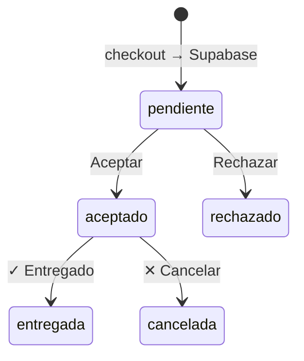

# Brava Burgers — planificación e ideas

Archivo vivo del proyecto. Acá anotamos ideas, prioridades y decisiones.  

Cuando quieras agregar algo, decilo en el chat y lo incorporamos acá.

---

## Lo que queremos (resumen — ago 2026)

Documento único de **alcance deseado**. Maquetas: `comanda-ejemplo.html`, `panel-pedidos-ejemplo.html`.

### 1. Tienda (ya operativa, ajustes menores)

- Catálogo y config desde **Google Sheet** (`productos`, `configuracion`) — **sin cambiar**.

- Cliente arma carrito → checkout → **WhatsApp** con el pedido (sigue existiendo).

- **Delivery solo** — **sin retiro en local** por ahora (alinear zonas en Sheet cuando toque).

- Checkout: **teléfono obligatorio** (hecho).

- **Aclaraciones** (ej. “sin salsa”) en pedido guardado y comanda (revisar si falta algún caso).

- Al confirmar pedido: **guardar en Supabase** (Vercel `/api/pedido`) además de abrir WA; incluir **ORN** en mensaje WA.

### 2. Guardar pedidos — Supabase (operaciones)

- Tablas **`orders`**, **`gastos`**, contador **`admin_counters`** (`orn_del`, `gasto_id`).

- Contador **`ORN-DEL-0001`** vía RPC `next_orn_del()` (solo delivery).

- Escritura/lectura desde **Vercel** (`api/pedido.js`, `api/admin.js`) con **service role** en servidor; nada secreto en el JS público.

- Cada pedido: datos cliente, tel, dirección, turno, zona, envío, **Efectivo / Mercado Pago**, ítems + aclaraciones (`items_json`), total, estado, flags **editado**, timestamps.

- Schema: **`supabase/schema.sql`**. Guías: **`AYUDA_SUPABASE.md`**, **`VERCEL_SUPABASE_RAPIDO.md`**.

- **Fallback legacy:** si Supabase no está configurado en Vercel, `/api/*` puede usar **Apps Script + Sheet** (`BRAVA_GAS_URL`). En producción el camino principal es **Supabase**.

### 3. Panel `/admin` (login usuario + contraseña)

Pantalla **Órdenes** tipo deli (referencia capturada), adaptada a Brava:

| Elemento | Detalle |

|----------|---------|

| **Pestañas** | **Pendientes** · **Aceptados** · **Rechazados** · **Entregados** · **Cancelados** |

| **Filtros** | Fecha desde/hasta, **Pago** (EF / MP), APLICAR / RESTABLECER *(pago/buscar: pendiente en UI)* |

| **Columnas** | Fecha, Cliente, **Teléfono**, Método de pago, Total, ORN, Acciones |

| **Buscar** | Operación diaria por **teléfono** / WhatsApp; ORN es **referencia** en comanda *(buscador: pendiente)* |

| **Pendientes** | Aviso sonoro · **Aceptar** / **Rechazar** · WA · ticket |

| **Aceptados** | **Editar** *(pendiente prod.)* · ticket · WA · **✓ entregado** · **✕ cancelar** |

| **Rechazados** | WA consulta · solo lectura |

| **✓ entregado** | Desde **Aceptados** → Entregados; **suma caja** (EF o MP) |

| **✕ cancelar** | Desde **Aceptados** → Cancelados |

| **Rechazar** | Desde **Pendientes** → Rechazados (modal motivos + WA) |

| **Editar** | Mismo ORN; reimprimir comanda; total final al entregar *(pendiente prod.)* |

| **Caja del día** | EF + MP entregados; cancelados info; **− gastos**; estados intermedios no suman |
| **Registro de ventas** | Por turno de caja: hamburguesas (simples/dobles) + **Acompañamientos** + **Extras** + **Bebidas** (catálogo completo del Sheet, cantidades del turno) |

| **Gastos** | Alta/baja en Supabase; restan del **resultado del día** |

| **Tiempo real** | **Supabase Realtime** en el navegador (+ polling de respaldo). Indicador “En vivo · Supabase” |

### 4. Comanda impresa (80 mm)

- **Igual** para Efectivo y Mercado Pago; solo cambia línea **Medio de pago**.

- Incluye: **ORN-DEL-…**, cliente, tel, dirección, turno, ítems, **Acl.:** por ítem, envío, total.

- **Sin “Estado”** en el papel.

- **Pendiente:** ~~imprimir desde panel~~ → Ticket abre comanda real (`admin/comanda.html`).

### 5. Mercado Pago

- **Solo etiqueta** en pedido y caja; **cobro manual** (transferencia, etc.).

- **Sin** cobro automático ni webhooks por ahora.

### 6. Fuera de alcance (por ahora)

- Retiro en local / `ORN-RET`.

- Pasarela MP online.

- Volver a usar **Sheet como fuente única** de pedidos en el día a día (reemplazado por Supabase para operaciones).

### 7. Por construir (orden lógico)

1. ~~Schema Supabase + Vercel env + `/api/pedido` + `/api/admin`~~ → hecho.

2. ~~Admin: pestañas, caja, gastos, rechazo, sonido~~ → hecho (Supabase).

3. ~~Comanda **dinámica** desde pedido real~~ → hecho (`/admin/comanda.html`).

4. **Editar** comanda en admin producción (solo en demo HTML por ahora).

5. Filtros **Pago** + **buscar por tel** + **RESTABLECER** en panel.

6. Opcional: importar histórico Sheet operaciones → Supabase; dual-write a Sheet (backup).

---

## En curso / próximo

1. Probar ciclo completo: pedido web → panel → aceptar → entregar → caja.

2. Usuario **Supabase Auth** (`admin@brava.com`) para Realtime estable.

3. Comanda dinámica + editar en Aceptados.

4. Actualizar este doc al cerrar cada ítem.

Implementado en repo: `supabase/schema.sql`, `lib/bravaSupabase.js`, `lib/supabaseServer.js`, `api/pedido.js`, `api/admin.js`, `admin/` (v20+).

---

## Decisiones (ago 2026 — actualizado)

| Tema | Decisión |

|------|----------|

| **Retiro en local** | **No** por el momento. Todos los pedidos son **delivery**. No usar `ORN-RET` hasta que exista retiro. |

| **Menú / tienda** | **Google Sheet** (`productos`, `configuracion`, `extras`) — catálogo tienda + registro de ventas admin. |

| **Operaciones (pedidos + caja + gastos + admin)** | **Supabase** (Postgres + Realtime + Auth para sesión admin). |

| **ORN** | Solo **`ORN-DEL-{NNNN}`** mientras no haya retiro. Contador en **`admin_counters`**. |

**Arquitectura actual:**

| Pieza | Rol |

|--------|-----|

| **Sheet (menú)** | Catálogo, precios, zonas, horarios, WhatsApp de la tienda; pestaña **`extras`** para conteo de ventas en admin |

| **Supabase `orders`** | Una fila por pedido: ORN, fechas, cliente, tel, dirección, pago, `items_json`, total, `estado`, timestamps, `rechazo_mensaje`, etc. |

| **Supabase `gastos`** | Gastos de caja (`GAS-0001` vía `next_gasto_id()`) |

| **Checkout web** | POST **`/api/pedido`** → insert en Supabase + WA con `*Ref:* ORN-DEL-…` |

| **`/admin`** | POST **`/api/admin`** → login Vercel (`ADMIN_USER`/`ADMIN_PASSWORD`); CRUD pedidos/gastos; Realtime opcional |

| **Login admin** | Usuario **`admin`** (no email) en el formulario; email Supabase solo para Realtime en servidor |

| **Apps Script + Sheet operaciones** | Legacy / respaldo si no hay Supabase; libro operaciones puede tener histórico previo a la migración |

**Contador ORN:** tabla **`admin_counters`**, clave `orn_del`. Ajuste manual vía SQL si importás histórico (ver `AYUDA_SUPABASE.md`).

---

## Ideas (backlog)

### Panel administrativo (consulta — feb 2026)

**Qué pidió el cliente:**

- Login con usuario y contraseña.

- Dashboard tipo **control de caja**: pedidos que entren, separar **Efectivo** vs **Mercado Pago**.

- Sector **delivery / comanda**: ver datos del cliente, productos, total.

**Estado:** backend en **Vercel + Supabase**; panel en **`/admin`**. Falta pulir ticket dinámico y editar comanda.

| Pieza | Para qué |

|--------|----------|

| **Backend** (API) | ✅ Vercel `api/pedido`, `api/admin` |

| **Base de datos** | ✅ Supabase `orders`, `gastos` |

| **Checkout → API** | ✅ Hecho |

| **Pantalla `/admin`** | ✅ Hecho (mejoras UX pendientes) |

| **Mercado Pago** | Solo etiqueta + caja manual |

**Opciones históricas:** ~~solo Google Sheets~~ → **híbrido**: Sheet menú + **Supabase operaciones** (ago 2026).

**Seguridad:** login validado en servidor (Vercel); claves Supabase solo en env; panel no usa email de Supabase en el login.

**Código de pedido (ORN):**

- Formato: **`ORN-DEL-{NNNN}`** (4 dígitos; contador Supabase).

- **Uso operativo:** ORN en comanda y panel; búsqueda diaria por **teléfono** + link WA.

**Estados del pedido (modelo actual — cinco pestañas):**

| Estado | Pestaña | Notas |

|--------|---------|--------|

| `pendiente` | Pendientes | Nuevo desde checkout; suena aviso |

| `aceptado` | Aceptados | Cocina / delivery |

| `rechazado` | Rechazados | Modal motivos + `rechazo_mensaje` |

| `entregada` | Entregados | Suma caja |

| `cancelada` | Cancelados | No suma ventas |

**Caja del día:** solo **`entregada`** suma EF/MP; **− gastos** del período; filtros de fecha compartidos.

**Registro de ventas (ago 2026 — hecho):** sidebar **Resumen operativo** y ticket **Cierre operativo** cuentan por turno (desde **Abrir caja** hasta **Cierre**):

| Sección | Fuente Sheet | Qué cuenta |
|---------|--------------|------------|
| **Hamburguesas** | `productos` (simples/dobles por nombre) | Unidades entregadas |
| **Acompañamientos** | `productos` (categoría acompañamiento / entrada / papas, etc.) | Ítems sueltos entregados |
| **Extras** | pestaña `extras` + extras en `variedad` de hamburguesas | Bacon, cheddar, pepinillos… |
| **Bebidas** | `productos` (categoría bebida) | Coca Cola, Zero, Sprite… |

- Lista **todo** lo cargado en el Sheet (incluso qty **0** en el ticket de cierre).
- **Sin hardcodear:** producto o extra nuevo en Sheet → aparece solo.
- Clasificación automática por `categoria` / `subcategoria` del Sheet.
- Snapshot en `cierres_caja.snapshot_json` incluye estos totales para reimpresión desde **Historial**.

**Referencia visual — pantalla “Órdenes”:** ver maqueta `panel-pedidos-ejemplo.html`. En producción: columnas similares; faltan filtro pago y buscar tel.

**Editar comanda (pendiente producción):** mismo ORN, `modificado` + `modificado_at`, total al entregar. Catálogo para precios sigue leyendo **Sheet** en la tienda; el admin debería reutilizar precios (API o cache).

**Aviso sonoro (ago 2026):** beep en ORN nuevo `pendiente`. **Supabase Realtime** en suscripciones `orders`/`gastos`; fallback polling ~0,4 s. Botón **Activar sonido** (política del navegador).

---

## Estados del pedido — flujo operativo (ago 2026)

| Pestaña admin | Valor `estado` en Supabase | Acciones principales |

|---------------|----------------------------|----------------------|

| Pendientes | `pendiente` | **Aceptar** · **Rechazar** · WhatsApp · Imprimir |

| Aceptados | `aceptado` | Editar *(pend.)* · **✓** · **✕** · WA · Imprimir |

| Rechazados | `rechazado` | WA; `rechazado_at`, `rechazo_mensaje` |

| Entregados | `entregada` | WA · ticket; `entregado_at` |

| Cancelados | `cancelada` | WA · ticket; `cancelado_at` |

**Modal rechazar:** motivos Local Cerrado / Problemas Técnicos / TURNO LLENO + texto + WA + confirmar en Supabase.

**Histórico Sheet:** pedidos viejos en libro **Operaciones** (Google) no están automáticamente en Supabase; migración opcional.

---

## Caja + gastos (ago 2026)

**UI:** un solo **`/admin`**, sidebar **Caja del día** + **Gastos**.

| Línea | Origen |

|--------|--------|

| Efectivo (entregados) | `orders` con `estado = entregada`, pago efectivo |

| Mercado Pago (entregados) | Igual, pago MP |

| **Ventas** | EF + MP |

| Cancelados (info) | Informativo |

| **Gastos** | Suma `gastos` en rango de fechas |

| **Resultado del día** | Ventas − gastos |

**Registro de ventas (sidebar):** debajo de hamburguesas → **Acompañamientos**, **Extras**, **Bebidas** (mismo catálogo y cantidades del turno que el ticket de cierre). Solo visible con **caja abierta**; al cerrar turno vuelve a 0.

**Cierre operativo:** ticket imprimible + historial con flujo de caja (EF/MP, ingresos, egresos, arqueo) y registro de ventas completo (hamburguesas + tres secciones anteriores).

**Datos Supabase — tabla `gastos`:**

| Campo | Ejemplo |

|--------|---------|

| id | `GAS-0001` |

| fecha | `2026-08-05` |

| concepto | “Pan — mayorista” |

| monto | `15000` |

| pagado_con | `efectivo` / `transferencia` / `otro` |

| creado_at | timestamp |

**API admin:** `listGastos`, `createGasto`, `deleteGasto` (mismos filtros **desde/hasta** que pedidos).

### WhatsApp Business API + inbox admin

**Estado:** ✅ **v1 en producción** (texto, pestañas, bienvenida, cierre de turno). Detalle, coexistencia y roadmap: **[`WHATSAPP_OPERACION.md`](WHATSAPP_OPERACION.md)**.

**Objetivo:** inbox real en `/admin` conectado a **Meta Cloud API**.

**Contexto acordado:**

- Número Brava: **+54 9 11 7372-1945** en API producción (app **BRAVADELI**). Celu con ese número **no** disponible hasta coexistencia o desregistrar API — ver doc coexistencia / chip prepago.

- Mensajes desde **celu (Business App + coexistencia futura)** → **$0** de API.

- Mensajes desde **panel/API** → gratis dentro de ventana 24 h; plantillas fuera ~USD 0,026 (utilidad).

- **Estados, grupos, llamadas** → solo celu; panel = chats **1 a 1**.

- Costo Meta estimado uso normal Brava: **USD 0–5/mes**.

**Hecho (v1):**

1. Webhook + Supabase `wa_messages` + envío `/api/whatsapp-send`.

2. Inbox: Pedidos activos / Consultas, badges no leídos, chip ORN, snippets, wa.me fallback.

3. Bienvenida 1× por cliente; purge de chats de pedido al cerrar turno.

**Próximo sugerido (pre-apertura):**

1. Sonido en mensaje WA entrante.

2. Plantillas Meta (rechazo / fuera de 24 h).

3. Coexistencia o chip prepago — [`WHATSAPP_OPERACION.md`](WHATSAPP_OPERACION.md).

**Referencia demo:** `demo-admin-whatsapp-inbox.html` (raíz workspace local).

---

## Hecho ✅

- Tienda Brava (Sheet `productos` + `configuracion` + `extras`; scripts `brava-catalog.js`, `brava-shop.js`, `brava-turnos.js`)

- Horarios tienda desde Sheet (`Horario abierto LUNES` … `SABADO`); hero 🟢 Abierto / 🔴 Cerrado; franja horaria en pie de página

- Checkout → **`/api/pedido`** → Supabase + ORN en WhatsApp

- Panel **`/admin`**: login, 5 pestañas, aceptar/rechazar, entregar/cancelar, caja, gastos, sonido, **ticket/comanda 80 mm**

- **Registro de ventas** por turno: acompañamientos, extras y bebidas dinámicos desde Sheet (Resumen operativo + Cierre operativo + historial snapshot)

- Backend operaciones en **Supabase** + env en **Vercel**

- Realtime Supabase (con fallback polling)

- Tema Brava, modals, menú colapsado, logo desde Sheet

- Apps Script legacy + Sheet operaciones (histórico / fallback)

---

## Notas técnicas

| Tema | Detalle |

|------|---------|

| **Menú** | Google Sheet → `brava-catalog.js` / `brava-shop.js` (admin lee `productos` + `extras` para registro de ventas) |

| **Operaciones** | Supabase (`supabase/schema.sql`); ver `.env.example` |

| **Deploy** | https://brava-burgers.vercel.app/ — repo `YezeGames/brava-burgers`, carpeta `BravaBurgers/` |

| **CSV locales** | `sheets/brava-configuracion.csv`, `sheets/brava-productos.csv` (referencia) |

---

## Pedido manual WhatsApp / teléfono (ago 2026)

Pedidos por WA o mostrador que no pasan por la web. **Plan detallado:** [`PEDIDO_MANUAL.md`](PEDIDO_MANUAL.md).

| Estado | Ítem |

|--------|------|

| **Demo UI** | `demo-admin-estado-salon-pedido-manual.html` — modal emisión, comanda+cobro, extras/envío como líneas, agenda cliente unificada |

| **Próximo** | Supabase `clientes` + columnas en `orders` + API + port al admin real |

| **Agenda** | Web y manual comparten teléfono; upsert en cada pedido; editar dirección para próximos pedidos |

| **Envío** | Líneas catálogo (601, 602…), no selector aparte |

---

## Zonas de entrega — My Maps (sep 2026)

Solo **checkout web**: al cargar dirección, detectar automáticamente si está **dentro o fuera** del área dibujada en **Google My Maps** (export KML → GeoJSON; validación point-in-polygon con lat/lng de Mapbox).

**Plan detallado:** [`ZONAS_ENTREGA.md`](ZONAS_ENTREGA.md)

| Estado | Ítem |

|--------|------|

| **Hoy** | Bbox aproximado en `address-suggest`; zonas/costo por Sheet + selector |

| **Próximo** | Export My Maps → `data/zonas-entrega.kml` + API `/api/delivery-zone` + bloqueo checkout fuera de zona |

| **Mapa** | [My Maps Brava Burgers](https://www.google.com/maps/d/viewer?mid=19CBdgAGGJnksChZYmVvWSzqaqTgZOuU) — 1 polígono cobertura |

| **Demo** | [`demo-tienda-zona-entrega.html`](demo-tienda-zona-entrega.html) — checkout + mapa (`npx vercel dev`) |

---

## Cómo usar este archivo

1. Mandá ideas por chat (una o varias).

2. Las clasificamos: **próximo**, **backlog**, o **descartado**.

3. Al implementar, movemos ítems a **Hecho**.

_Última actualización: registro de ventas (acompañamientos / extras / bebidas) dinámico desde Sheet en admin; horarios tienda desde Sheet; scripts tienda renombrados `brava-*`._

